# Tracker

Настраиваемый трекер времени, и несколько скриптов для аналитики и изучения полученных данных.

## Установка

Помимо этого архива для работы требуется [Python3](https://www.python.org), библиотека `matplotlib` для работы с графиками, библиотеки `Pillow` и `numpy` для создания кружочка времени. Библиотека `tqdm` для отрисовки прогресс бара, а также `rich` для отрисовки таблицы активностей и инструкции.

```shell
pip3 install -r requirements.txt
```

## Использование

Основным скриптом считается `tracker.py`, с его помощью можно отслеживать время.

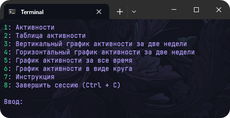

Управление происходит вручную, после завершения одного этапа сразу начинается другой (пустоты между этапами нет). Формат этапов в сохранении сплошной, доступно также редактирование последнего этапа из трекера. Можно использовать константы для секунды, минуты, часа, дня и недели (`SECOND`, `MINUTE`, `HOUR`, `DAY`, `WEEK`), формат записи как у обычного python выражения.

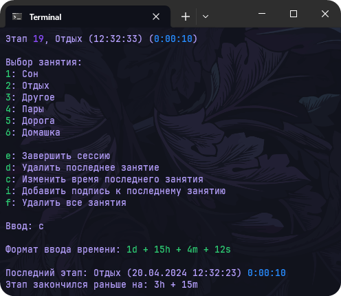

При удалении этапа предыдущий занимает всё его время.

```
    До удаления               После
| этап 1 | этап 2 |  -> |     этап 1      |
```

### Файл сохранения

В файле сохранения `save.py` содержатся для каждого этапа его название, unit-time метка начала этапа, читаемое представление метки и подпись к этапу.

```
| этап 1 | этап 2 |
^        ^        ^
|        |        timestamp (конец)
|        unix-time (начало 2 этапа)
unix-time (начало 1 этапа)
```

Файл сохранения выглядит следующим образом:

```python
saved = True
timestamp = 1670744270.0
activities = [
    ["Отдых", 1670698800.0, "10.12.2022 22:00:00", "Начало"],
    ["Сон", 1670704503.0, "10.12.2022 23:35:03", ""],
    ["Отдых", 1670738442.0, "11.12.2022 09:00:42", ""],
    ["Другое", 1670740670.0, "11.12.2022 09:37:50", "Поход в горы"],
]
```

В скриптах не используется текстовое представление времени, оно необходимо только для поиска нужной даты для редактирования. Если вы хотите изменить данные в файле сохранения вручную, то меняйте unix-time метку этого этапа (число). Для перевода времени из одного формата в другой можно использовать скрипт `timestamper.py`.

Раз в неделю (от первого этапа) трекер будет создавать бэкап сохранения. Файлы бэкапов будут храниться в папке `dumps`.

## Аналитика

При выходе из трекера он будет показывать простую аналитику по файлу сохранения.

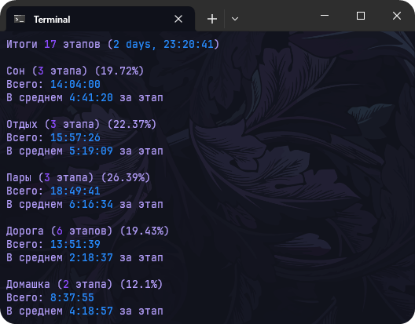

Помимо этого можно использовать разные скрипты для более наглядной визуализации полученных данных. Два основных скрипта для просмотра файла сохранения - `bar.py` и `barh.py`.

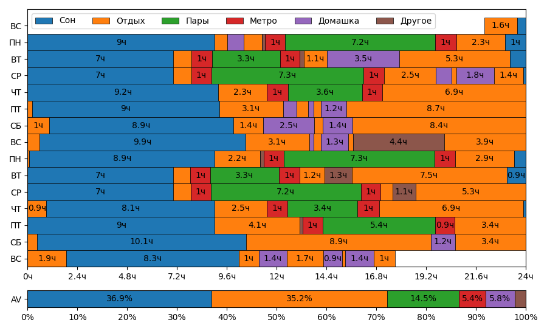

Скрипты отображают этапы из файла сохранения по дням. Окно просмотра ограничено последними двумя неделями. Внизу есть отдельный график с процентным распределением этапов за всё время. При просмотре с matplotlib при наведении на каждый этап появляется дополнительная информация.

Если файл сохранения очень большой, то можно воспользоваться скриптами `map.py` и `density.py` для просмотра глобальной статистики: карты всего сохранения и динамики плоности каждого из этапов по неделям, или за всё время.

Скрипт `map.py` отображает все этапы всего файла сохранения. С его помощью можно изучать большие файлы сохранений.

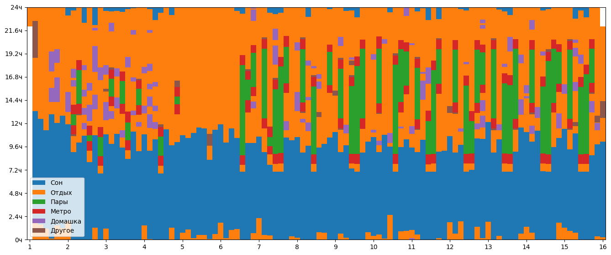

Скрипт `density.py` отображает среднее время каждого из этапов по неделям.

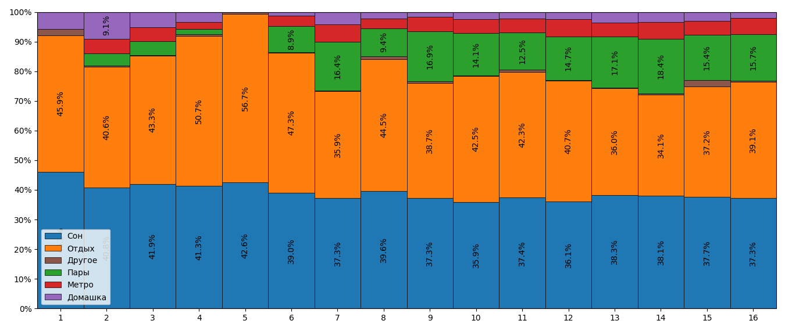

Также можно настроить отображение так, чтобы плотности показывались не за каждую неделю, а не за всё время (накопительно).

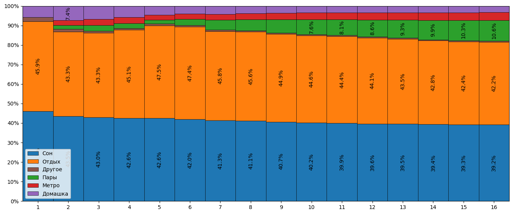

Ещё можно создать кружок времени с помощью `circles.py`

|  | 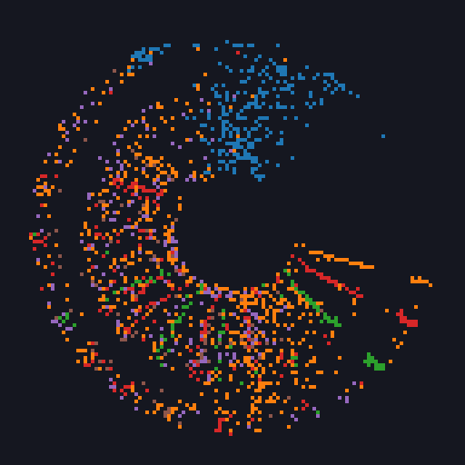 |
| --------------------------------- | --------------------------------- |

Чем больше файл сохранения, тем больше точек. Круг представляет собой 24 часовой циферблат, вверху полночь. Расстояние
точки (времени начала этапа) от центра зависит от недели.

## Настройки

Все доступные настройки для всех скриптов приведены в файле `settings.toml`. Также для каждого скрипта при его использовании определены параметры, которые можно менять из консоли. Для того чтобы узнать доступные для изменения из консоли параметры при выполнении скрипта добавьте флаг `--help`.

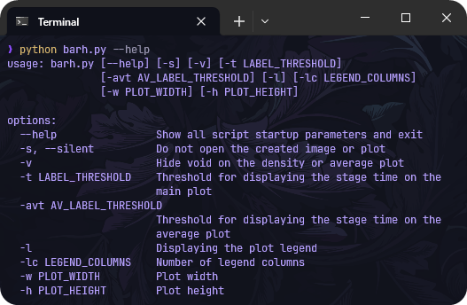

Для каждого скрипта список параметров свой. Все возможные параметры для каждого скрипта можно посмотреть в файле `settngs.toml` в соответствующих секциях. Не все параметры, перечисленные в файле настроек могут быть изменены из консоли.

Ещё можно менять список доступных этапов. Из этого можно, например, из трекера свободного времени сделать трекер для игр. Доступные для выбора этапы трекера определяются в секции `[activities]`. Для каждого занятия надо определить в массиве его цвет для отображения на графике в формате rgb:

```toml
[activities]
"Borderlands 2" = [255, 127, 14]
"Stone Story" = [128, 128, 128]
"Katana Zero" = [149, 103, 189]
"Hotline Miami 2" = [214, 39, 40]
"The Witness" = [42, 172, 251]
# "Название этапа" = [r, g, b]  # цвет для matplotlib

"Пустота" = [0, 0, 0]

[global]
VOID = "Пустота"
# ...
```

Порядок названий определяет порядок отображения активностий в списке среднего времени и на легенде.

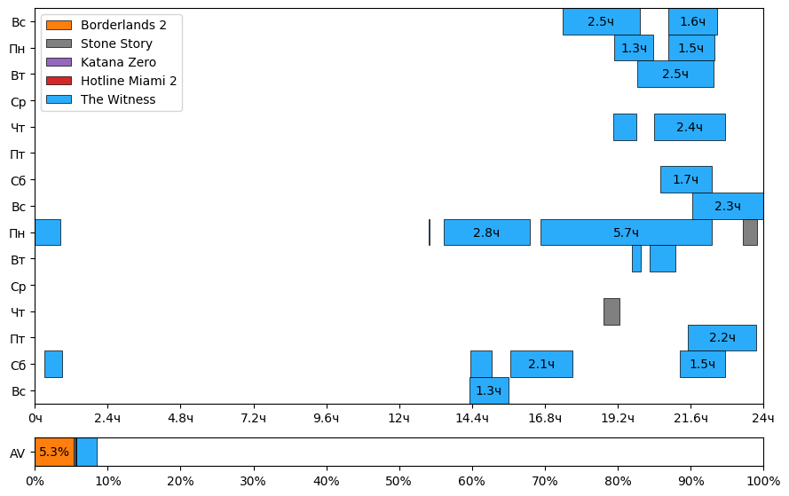

Также можно создать и определить `VOID` этап. Этот этап не отображается на легенде и на графике. Для скриптов доступен флаг для исключения Void этапа. При этом флаге график среднего времени будет иметь лимит времени, исключающий Void:

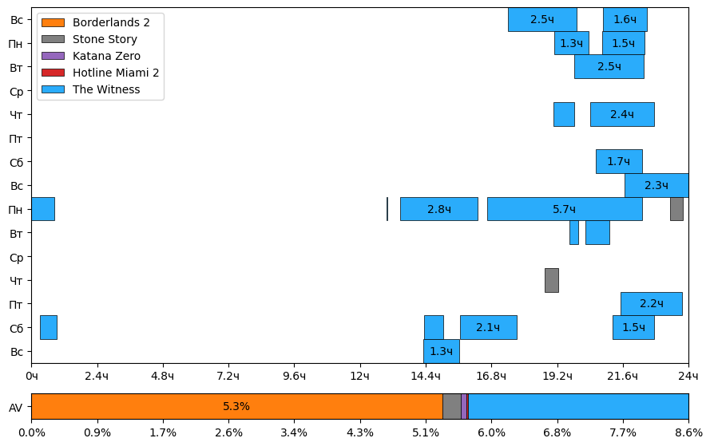

Для правильной работы Void этап обязан быть последним в секции `[activities]` файла настроек, название этапа пустоты определяется значением поля `VOID` в секции `[global]`. Так же для возможности исключения `Void` этапа он обязан присутствовать в файле сохранения.
